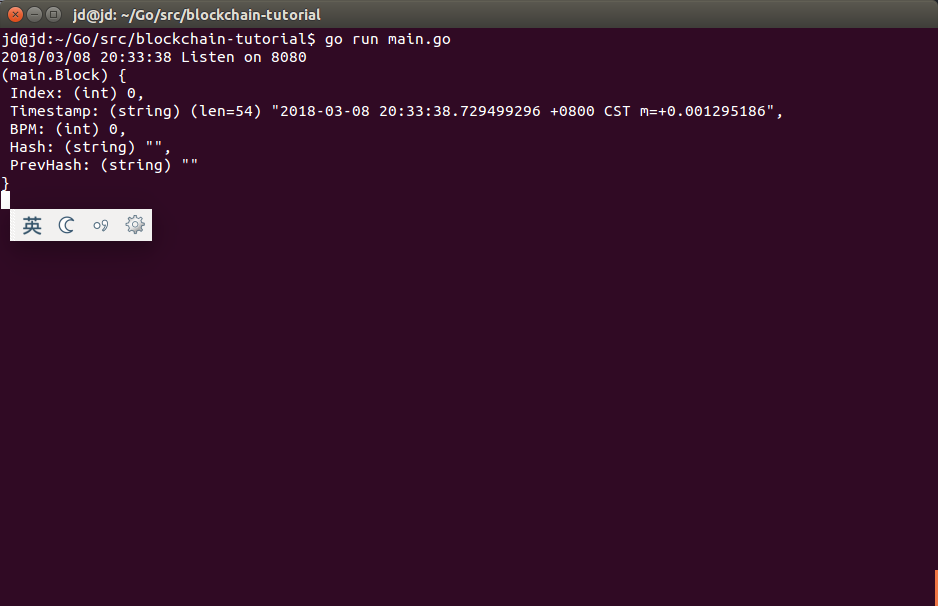
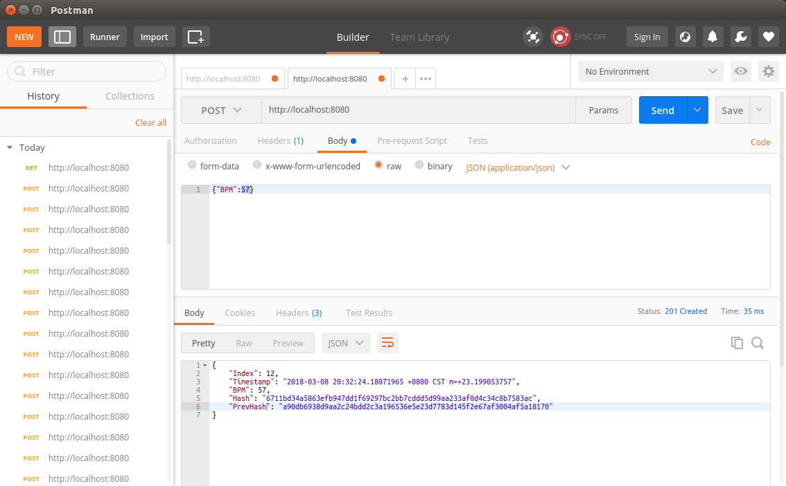
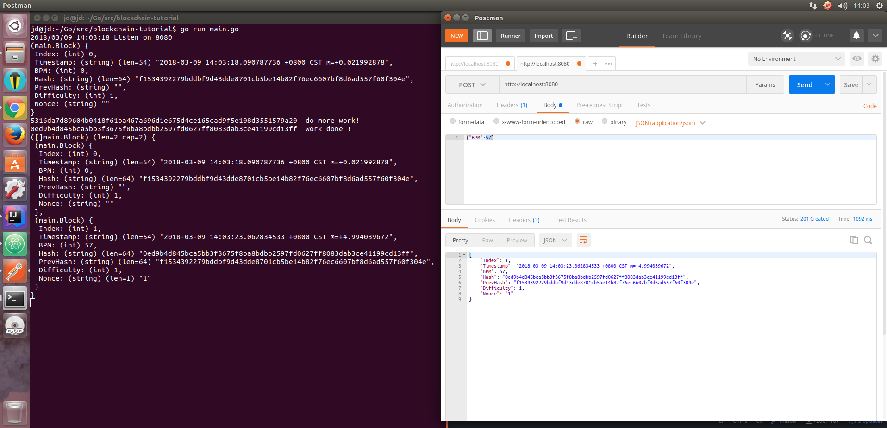

# blockchain-tutorial
简单的区块链练习


# Version 1.0
1. 创建自己的区块链
2. 理解hash函数是如何保持区块链的完整性
3. 如何创造并添加新的块
4. 多个节点如何竞争生成块
5. 通过浏览器来查看整个链

在当前版本中，实现了区块链的以下基本功能
1. 块生成
2. 散列计算
3. 块校验
4. 通过POST请求发送交易，通过GET请求查询所有区块的功能

具体的操作信息如下图所示：

启动程序：


发送数据生成区块


查询所有交易信息


在实现过程中：

每个区块包含的信息
```go
type Block struct {
  Index     int  //这个块在链中的位置
  Timestamp string // 块生成的时间戳
  BPM       int   //心跳数据 BPM 心率
  Hash      string   //这个块通过SHA256算法生成的散列值
  PrevHash  string //前一个块的SHA256散列值
}
```

负载信息 payload
```go
type Message struct {
  BPM int
}
```

一些依赖信息：

```go
//spew 可以帮助我们在 console 中直接查看 struct 和 slice 这两种数据结构。
go get github.com/davecgh/go-spew/spew

//Gorilla 的 mux 包非常流行， 用它来写 web handler。
go get github.com/gorilla/mux

//godotenv 读取项目根目录中的 .env 配置文件，不用将 http port 之类的配置硬编码进代码中
go get github.com/joho/godotenv

```
需要散列的原因，主要是两个原因：
1.在节省空间的前提下去唯一标识数据。散列是用整个块的数据计算得出，在我们的例子中，将整个块的数据通过 SHA256 计算成一个定长不可伪造的字符串。
2.维持链的完整性。通过存储前一个块的散列值，我们就能够确保每个块在链中的正确顺序。任何对数据的篡改都将改变散列值，同时也就破坏了链。以我们从事的医疗健康领域为例，比如有一个恶意的第三方为了调整“人寿险”的价格，而修改了一个或若干个块中的代表不健康的 BPM 值，那么整个链都变得不可信了。

还有一个问题没有解决：
两个节点都生成块并添加到各自的链上，那我们应该以谁为准？始终选择最长的，但是这个问题在这里没有解决。

# Version 2.0
解决多节点网络内,
1. 区块生成
2. 节点通信问题
3. 消息广播问题

本质上是解决区块链的网络通信问题。

网络构建的步骤：
1. 第一个节点A创建"创世区块"， 同时启动TCP Server并监听一个接口， 等待其它节点连接
2. 启动节点B，并与第一个节点建立TCP连接(通过不同的终端来模拟其他节点， 启动和连接方式如图1 所示)， 并发送数据给A
3. 第一个节点收到来自B的消息，创建第一个区块，验证后广播给其他节点
4. 向所有节点同步新链状态


并非是一个P2P的网络，没有选举算法，同样没有共识算法，但是解决了网络的基本构建问题。

图 1


# Version 3.0
工作量证明（Proof of Work, PoW)

添加工作两证明所需的变量：
```go
// Block represents each 'item' in the blockchain
type Block struct {
	Index      int
	Timestamp  string
	BPM        int
	Hash       string
	PrevHash   string
	Difficulty int
	Nonce      string
}
```
重新修改generateBlock函数

结果演示




##下一步学习， IPFS存取大文件并与区块链打通
